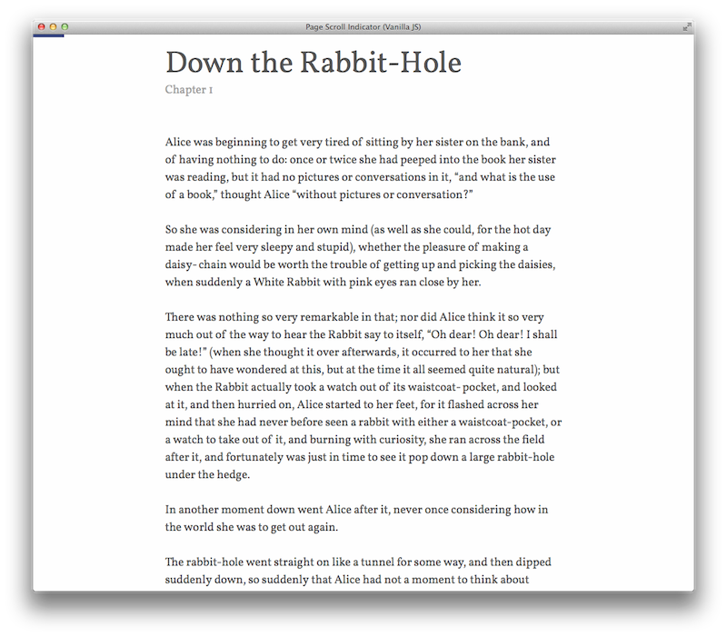

# Page Scroll Indicator

An simple JS plugin to fix a small progress bar to the top of a page that
tracks how far the user has scrolled vertically.

You can see the plugin in action [here.](http://alssndro.github.io/page-scroll-indicator/jquery-example.html)



## How To Use

Download either the [vanilla JS](js/vanilla/page_scroll_indicator.js) or [jQuery](js/jquery/page_scroll_indicator.js) version. You will also need the [base CSS styles](css/progress_bar.css) for the progress bar and its container.

Then in your JS, pass the element ID of the div you'd like to attach the progress bar to, and the element whose scroll you would like to track progress of:

```
  // Vanilla JS
  PageScrollIndicator.createProgressBar("container", "main");
  
  //jQuery
  PageScrollIndicator.createProgressBar("#container", "#main");
```

## Styling The Progress Bar

Apply your CSS to the `#progess-cont` and `#progress-bar` elements.
